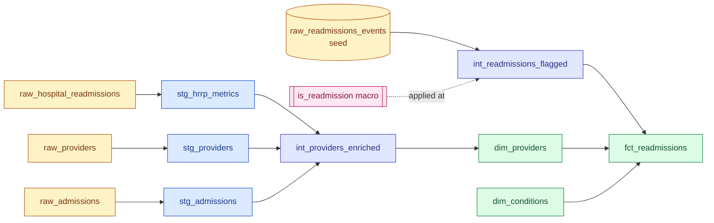

# CMS Hospital Readmissions — dbt + Databricks

A working dbt analytics engineering project built on CMS Hospital Readmissions
Reduction Program (HRRP) data, demonstrating source-to-marts transformation
patterns on Databricks. Built as a portable simulation of the architecture
patterns appropriate for hospital-system Quality-domain analytics.

## What this project does

Takes three CMS public datasets (Hospital Readmissions Reduction Program metrics,
Hospital General Information, and Inpatient Prospective Payment System Final
Rule provider files) plus a synthesized seed of patient admission events, and
transforms them through a staging → intermediate → marts pipeline into three
analysis-ready tables that answer:

- Which providers carry HRRP excess-readmission ratios above 1.0, and what are
  their attributes (region, ownership, bed size, teaching status)?
- For a simulated patient population, what is the 30-day readmission rate by
  diagnosis category, after applying the HRRP planned-admission exclusion rule?
- How does the simulated readmission pattern compare against the real CMS
  excess-readmission ratios for the same condition cohorts?

The conformance rule (30-day window, exclude planned cancer/transplant/rehab
admissions) lives in `macros/is_readmission.sql` and is applied at the
intermediate layer, not in the marts. Marts are thin projections.

## Dataflow



The conformance rule (30-day readmission window, excluding planned cancer,
transplant, and rehab admissions) lives in `macros/is_readmission.sql` and is
applied at the intermediate layer. Marts are thin projections that consume
already-flagged data — separation of "rule enforcement" from "presentation"
is intentional.

## Data Schema

**Sources** (CMS public data, loaded as Databricks tables):

| Table | Grain | Row count |
|---|---|---|
| `raw_hospital_readmissions` | one row per provider × condition × FY | ~19,500 |
| `raw_providers` | one row per provider × FY × record version | ~1.18M |
| `raw_admissions` | one row per provider | ~5,400 |
| `raw_readmissions_events` (seed) | one row per simulated admission event | ~3,000 |

**Marts:**

| Table | Grain | Purpose |
|---|---|---|
| `dim_providers` | one row per HRRP-eligible hospital | Provider attributes + most-recent HRRP rollup |
| `dim_conditions` | one row per HRRP measure code | Condition lookup with display names |
| `fct_readmissions` | one row per simulated index admission | Index-admission grain with `is_readmission` flag and condition/provider FKs |

## Local Setup

```bash
git clone git@github.com:tmukherjee2022/cms-readmissions-dbt.git
cd cms-readmissions-dbt
python3 -m venv .venv && source .venv/bin/activate
pip install dbt-core dbt-databricks
dbt deps
```

Configure `~/.dbt/profiles.yml` with your Databricks workspace host, HTTP path,
and personal access token. Then:

```bash
dbt debug          # verify connection
dbt seed           # load the synthesized event seed and CMS code lookup
dbt build          # run + test the full pipeline
dbt docs generate && dbt docs serve   # browse the lineage graph
```

## Project Structure
cms_databricks/
├── dbt_project.yml             # Project config; routes models to schemas
├── profiles.yml                # NOT committed; lives at ~/.dbt/
├── packages.yml                # dbt_utils dependency
├── data_raw/                   # Local copies of source CSVs (gitignored)
├── docs/
│   └── screenshots/            # Lineage graph + dashboard previews
├── macros/
│   ├── generate_schema_name.sql  # Override schema prefixing
│   ├── is_readmission.sql        # The HRRP conformance rule
│   └── safe_cast.sql             # Type-cast helpers for CMS sentinels
├── models/
│   ├── _project_overview.md      # dbt docs landing page
│   ├── staging/
│   │   ├── sources.yml
│   │   ├── _stg_models.yml       # Tests + descriptions
│   │   ├── stg_hrrp_metrics.sql
│   │   ├── stg_admissions.sql
│   │   └── stg_providers.sql
│   ├── intermediate/
│   │   ├── _int_models.yml
│   │   ├── int_providers_enriched.sql
│   │   └── int_readmissions_flagged.sql
│   └── marts/
│       ├── _marts_models.yml
│       ├── dim_providers.sql
│       ├── dim_conditions.sql
│       └── fct_readmissions.sql
└── seeds/
├── cms_provider_type_codes.csv  # HRRP eligibility taxonomy
└── raw_readmissions_events.csv  # Synthesized patient events

## Caveat — Demo on Free Tier

This project runs on Databricks Community Edition, which means a few things
the reader should know:

- The Unity Catalog feature set isn't available — schemas are flat rather
  than catalog-prefixed, and row-level access controls aren't demonstrated here.
- Cluster size is small; query performance is not representative of a paid
  workspace.
- The `raw_readmissions_events` seed is synthesized rather than sourced from
  a real claims feed. The synthesis is plausible (provider IDs match the real
  CMS provider universe; admission dates and diagnosis categories follow
  realistic distributions) but it is not real patient data.

The patterns here scale unchanged: staging absorbs source quirks, seeds encode
business rules as data, macros hold conformance logic, and schemas form a
medallion. Moving from Community Edition to a paid Databricks workspace is an
implementation change, not an architecture change.